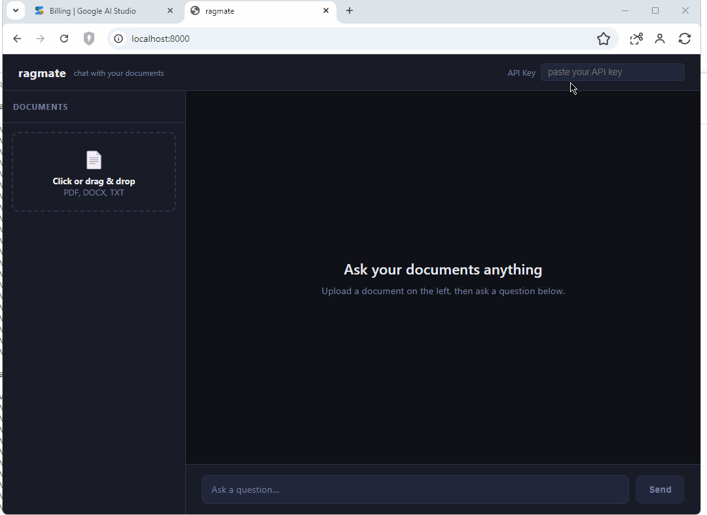

# ragmate

**AI powered Retrieval-Augmented Generation (RAG) system for chatting with your documents.**

Upload PDFs, Word docs, Markdown, or plain text and ask questions in natural language. ragmate embeds your documents into a vector store, retrieves the most semantically relevant passages at query time, and passes them as context to Gemini to generate grounded answers with source citations. It grounds the answers it generates on the documents you provide instead of relying on prior training data.

[](https://github.com/rajeshsub/ragmate/actions/workflows/ci.yml)
[](https://www.python.org/downloads/)
[](LICENSE)
[](https://github.com/psf/black)

---



---

## What it does

1. **Upload** a document (PDF, DOCX, Markdown, or TXT) - up to 2 files at once, 20 MB each max
2. ragmate parses it, splits it into chunks, and embeds each chunk using Google's `gemini-embedding-001` model
3. **Ask a question** - ragmate embeds your query, finds the top matching chunks via cosine similarity, and passes them to Gemini 2.5 Flash to generate a grounded answer
4. Every answer includes **source citations** showing which chunk and document it came from

---

## Web UI

A built-in web interface is served at `http://localhost:8000`:

- Drag-and-drop or click to upload documents (up to 2 at a time, 20 MB each max)
- Real-time upload progress with percentage via Server-Sent Events
- Document list with upload timestamps and delete support
- Chat interface with expandable source citations

API docs (Swagger) available at `http://localhost:8000/docs`.

---

## RAG Architecture

```
┌─────────────────────────────────────────────────────────┐
│                        Client                           │
│              (Web UI / curl / Swagger UI)               │
└────────────────────────┬────────────────────────────────┘
                         │  HTTP  X-API-Key
                         ▼
┌─────────────────────────────────────────────────────────┐
│                   FastAPI (ragmate)                      │
│                                                         │
│  POST /documents   GET /documents   DELETE /documents   │
│  POST /query       GET /health      GET /               │
└──────────────┬──────────────────────────┬───────────────┘
               │                          │
    ┌──────────▼──────────┐   ┌───────────▼───────────┐
    │  Ingestion Pipeline │   │  Retrieval Pipeline   │
    │                     │   │                       │
    │  parse → chunk      │   │  embed query          │
    │  → embed → store    │   │  → vector search      │
    └──────────┬──────────┘   │  → generate answer    │
               │              └───────────┬───────────┘
               │                          │
    ┌──────────▼──────────────────────────▼───────────┐
    │               ChromaDB (on disk)                │
    │                                                 │
    │  chunks collection   document_meta collection   │
    │  (vectors + text)    (filename, chunk_count,    │
    │                       uploaded_at)              │
    └─────────────────────────────────────────────────┘
               │                          │
    ┌──────────▼──────────┐   ┌───────────▼───────────┐
    │  Google Embeddings  │   │   Gemini 2.5 Flash    │
    │  gemini-embedding-  │   │  (answer generation)  │
    │       001           │   └───────────────────────┘
    └─────────────────────┘
```

---

## Tech Stack

| Layer | Technology |
|---|---|
| API framework | FastAPI + uvicorn |
| LLM | Gemini 2.5 Flash (`gemini-2.5-flash`) |
| Embeddings | `gemini-embedding-001` (768-dim, batched) |
| Vector store | ChromaDB (in-process, persistent) |
| Document parsing | pypdf, python-docx |
| Progress streaming | Server-Sent Events (SSE) |
| Validation | Pydantic v2 |
| Testing | pytest, pytest-asyncio, pytest-cov (84% coverage) |
| Linting / formatting | ruff, black |
| Type checking | mypy (strict) |
| Security scanning | bandit |
| Containerization | Docker |
| CI | GitHub Actions |

---

## Quickstart

### Prerequisites

- Python 3.13+
- A [Google AI Studio](https://aistudio.google.com/app/apikey) API key (free tier works)

### 1. Clone and bootstrap

```bash
git clone https://github.com/rajeshsub/ragmate.git
cd ragmate
make bootstrap
```

This creates a virtualenv, installs all dependencies, sets up pre-commit hooks, and copies `.env.example` → `.env`.

### 2. Add your API keys

Open `.env` and fill in the two required values:

```env
GEMINI_API_KEY=your-gemini-api-key-here
API_KEY=choose-any-strong-secret-string
```

- `GEMINI_API_KEY`: get one free at [Google AI Studio](https://aistudio.google.com/app/apikey)
- `API_KEY`: any string you choose; used to protect the ragmate endpoints

### 3. Run

```bash
make dev
```

Open `http://localhost:8000` for the web UI, or `http://localhost:8000/docs` for the API explorer.

### 4. Run with Docker

```bash
docker build -t ragmate .
docker run -p 7860:7860 \
  -e GEMINI_API_KEY=your-key \
  -e API_KEY=your-secret \
  -v $(pwd)/chroma_data:/app/chroma_data \
  ragmate
```

---

## API Reference

All endpoints require the `X-API-Key` header.

### Upload a document

```bash
curl -X POST http://localhost:8000/documents \
  -H "X-API-Key: your-secret" \
  -F "file=@/path/to/document.pdf"
```

Returns a Server-Sent Events stream with real-time progress:

```
data: {"stage": "parsing", "pct": 5, "message": "Parsing document.pdf…"}
data: {"stage": "embedding", "pct": 45, "message": "Embedding batch 1/2…"}
data: {"stage": "done", "pct": 100, "id": "3f4a1b2c-…", "filename": "document.pdf", "chunk_count": 42}
```

### Ask a question

```bash
curl -X POST http://localhost:8000/query \
  -H "X-API-Key: your-secret" \
  -H "Content-Type: application/json" \
  -d '{"question": "What are the main conclusions?"}'
```

```json
{
  "answer": "The main conclusions are...",
  "sources": [
    {
      "doc_id": "3f4a1b2c-...",
      "chunk_index": 7,
      "score": 0.9231,
      "excerpt": "In conclusion, the study found..."
    }
  ]
}
```

### List documents

```bash
curl http://localhost:8000/documents -H "X-API-Key: your-secret"
```

### Delete a document

```bash
curl -X DELETE http://localhost:8000/documents/3f4a1b2c-... \
  -H "X-API-Key: your-secret"
```

---

## Development

```bash
make test        # run all tests (80% coverage gate)
make lint        # ruff + mypy + bandit
make format      # auto-fix with ruff + black
make coverage    # generate htmlcov/index.html
make docs        # export openapi.json
```

---

## Supported file types

| Format | Extension | Parser |
|---|---|---|
| PDF (text-based) | `.pdf` | pypdf |
| Word document | `.docx` | python-docx |
| Markdown | `.md` | plain text |
| Plain text | `.txt` | plain text |

> Scanned / image-based PDFs are not supported (no OCR). Text must be selectable in the PDF.

---

## Design Decisions

Key architectural choices are recorded as ADRs in [`docs/adr/`](docs/adr/):

- [ADR 0001](docs/adr/0001-chromadb-only-no-postgres.md): ChromaDB as sole data store (no Postgres)
- [ADR 0002](docs/adr/0002-gemini-free-tier.md): Gemini 2.5 Flash + gemini-embedding-001
- [ADR 0003](docs/adr/0003-static-api-key-auth.md): Static API key authentication

---

## License

[MIT](LICENSE)
